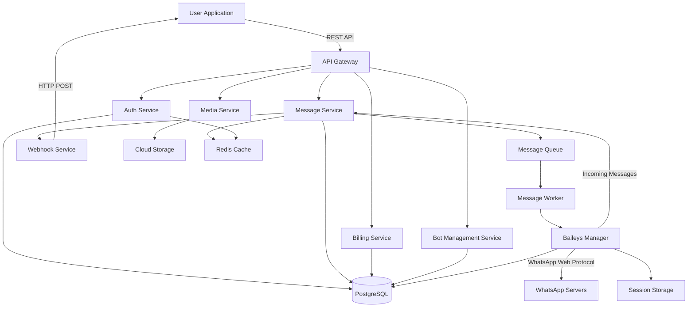

# Design Document

## Overview

WhatsApp API Monetization Platform представляет собой многоуровневую систему, которая служит посредником между пользователями и WhatsApp Business API. Платформа обеспечивает аутентификацию, маршрутизацию сообщений, управление балансом, webhook-уведомления и монетизацию через pay-per-use модель.

Система построена на микросервисной архитектуре с использованием REST API для внешних интеграций и event-driven подхода для внутренней коммуникации между сервисами.

## Architecture

### High-Level Architecture



### Technology Stack

**Backend:**
- Node.js with Express.js для API Gateway и микросервисов
- TypeScript для type safety
- PostgreSQL для реляционных данных
- Redis для кэширования и rate limiting
- RabbitMQ или AWS SQS для message queue
- AWS S3 или аналог для хранения медиа файлов

**Infrastructure:**
- Docker для контейнеризации
- Kubernetes для оркестрации (опционально)
- Nginx как reverse proxy
- PM2 для process management

**External Services:**
- Baileys (WhatsApp Web Multi-Device API)
- Stripe для платежей (поддержка EUR и SEPA)
- SendGrid для email уведомлений

## Components and Interfaces

### 1. API Gateway

**Responsibilities:**
- Маршрутизация входящих запросов к соответствующим микросервисам
- Rate limiting и throttling
- Request validation
- CORS handling
- Logging и monitoring

**Endpoints:**

```typescript
// Authentication
POST /api/v1/auth/register
POST /api/v1/auth/login
POST /api/v1/auth/refresh
GET /api/v1/auth/api-keys
POST /api/v1/auth/api-keys/regenerate

// Messages
POST /api/v1/messages/send
GET /api/v1/messages/:messageId
GET /api/v1/messages/history

// Media
POST /api/v1/media/upload
GET /api/v1/media/:mediaId

// Bots
POST /api/v1/bots
GET /api/v1/bots
GET /api/v1/bots/:botId
PUT /api/v1/bots/:botId
DELETE /api/v1/bots/:botId
GET /api/v1/bots/:botId/qr
POST /api/v1/bots/:botId/disconnect

// Billing
GET /api/v1/billing/balance
POST /api/v1/billing/topup
POST /api/v1/billing/withdraw
GET /api/v1/billing/transactions

// Statistics
GET /api/v1/statistics/messages
GET /api/v1/statistics/costs

// Webhooks (incoming from WhatsApp)
POST /api/v1/webhooks/whatsapp
```

### 2. Auth Service

**Responsibilities:**
- Управление пользователями и аутентификацией
- Генерация и валидация API ключей
- JWT token management
- Password hashing и security
- Email verification workflow

**Design Rationale:**
- Email verification требуется перед генерацией API ключа (Requirement 1.2) для предотвращения спама и обеспечения валидности контактов
- API ключи генерируются автоматически после верификации email для упрощения onboarding процесса
- Поддержка регенерации API ключей с подтверждением для безопасности (Requirement 1.5)

**Interface:**

```typescript
interface AuthService {
  registerUser(email: string, password: string): Promise<User>;
  loginUser(email: string, password: string): Promise<AuthToken>;
  validateApiKey(apiKey: string): Promise<User>;
  generateApiKey(userId: string, botId?: string): Promise<string>;
  regenerateApiKey(userId: string, requireConfirmation: boolean): Promise<string>;
  verifyEmail(userId: string, token: string): Promise<void>;
  sendVerificationEmail(userId: string): Promise<void>;
}

interface User {
  id: string;
  email: string;
  passwordHash: string;
  apiKeys: ApiKey[];
  createdAt: Date;
  emailVerified: boolean;
}

interface ApiKey {
  id: string;
  key: string;
  userId: string;
  botId?: string;
  createdAt: Date;
  lastUsedAt?: Date;
  isActive: boolean;
}

interface AuthToken {
  accessToken: string;
  refreshToken: string;
  expiresIn: number;
}
```

### 3. Message Service

**Responsibilities:**
- Обработка исходящих сообщений
- Валидация phone numbers и message content
- Постановка сообщений в очередь
- Tracking message status
- Auto-response logic

**Interface:**

```typescript
interface MessageService {
  sendMessage(request: SendMessageRequest): Promise<MessageResponse>;
  getMessageStatus(messageId: string): Promise<MessageStatus>;
  getMessageHistory(botId: string, filters: HistoryFilters): Promise<Message[]>;
  processIncomingMessage(webhook: WhatsAppWebhook): Promise<void>;
  createAutoResponse(botId: string, rule: AutoResponseRule): Promise<void>;
}

interface SendMessageRequest {
  botId: string;
  to: string; // Phone number in E.164 format
  type: 'text' | 'image' | 'video' | 'document' | 'audio' | 'interactive';
  content: MessageContent;
}

interface MessageContent {
  text?: string;
  mediaId?: string;
  buttons?: Button[];
  caption?: string;
}

interface Button {
  id: string;
  type: 'reply' | 'url';
  title: string;
  payload?: string;
  url?: string;
}

interface MessageResponse {
  messageId: string;
  status: 'queued' | 'sent' | 'delivered' | 'read' | 'failed';
  timestamp: Date;
  cost: number;
}

interface Message {
  id: string;
  botId: string;
  direction: 'inbound' | 'outbound';
  from: string;
  to: string;
  type: string;
  content: MessageContent;
  status: string;
  timestamp: Date;
  cost?: number;
}
```

### 4. Media Service

**Responsibilities:**
- Upload и хранение медиа файлов
- Валидация file types и sizes
- Генерация signed URLs для доступа
- Интеграция с cloud storage

**Interface:**

```typescript
interface MediaService {
  uploadMedia(file: Buffer, metadata: MediaMetadata): Promise<MediaResponse>;
  getMedia(mediaId: string): Promise<MediaFile>;
  deleteMedia(mediaId: string): Promise<void>;
}

interface MediaMetadata {
  botId: string;
  filename: string;
  mimeType: string;
  size: number;
}

interface MediaResponse {
  mediaId: string;
  url: string;
  expiresAt: Date;
}

interface MediaFile {
  id: string;
  botId: string;
  filename: string;
  mimeType: string;
  size: number;
  storageUrl: string;
  createdAt: Date;
}
```

### 5. Billing Service

**Responsibilities:**
- Управление балансами пользователей
- Обработка транзакций (пополнение, списание, вывод)
- Интеграция с платежными системами
- Pricing logic

**Interface:**

```typescript
interface BillingService {
  getBalance(userId: string): Promise<Balance>;
  deductCost(userId: string, amount: number, reason: string): Promise<Transaction>;
  topUpBalance(userId: string, amount: number, paymentMethod: string): Promise<Transaction>;
  withdrawFunds(userId: string, amount: number, bankDetails: BankDetails): Promise<Transaction>;
  getTransactions(userId: string, filters: TransactionFilters): Promise<Transaction[]>;
  calculateMessageCost(messageType: string): number;
}

interface Balance {
  userId: string;
  amount: number;
  currency: string; // Default: 'EUR'
  updatedAt: Date;
}

interface Transaction {
  id: string;
  userId: string;
  type: 'topup' | 'deduction' | 'withdrawal';
  amount: number;
  balanceBefore: number;
  balanceAfter: number;
  status: 'pending' | 'completed' | 'failed';
  reason?: string;
  timestamp: Date;
}

interface BankDetails {
  accountNumber: string;
  bankName: string;
  accountHolder: string;
}
```

### 6. Bot Management Service

**Responsibilities:**
- Создание и управление ботами
- Конфигурация webhook URLs
- Auto-response rules management
- Bot settings и preferences

**Interface:**

```typescript
interface BotService {
  createBot(userId: string, config: BotConfig): Promise<Bot>;
  getBot(botId: string): Promise<Bot>;
  updateBot(botId: string, updates: Partial<BotConfig>): Promise<Bot>;
  deleteBot(botId: string): Promise<void>;
  listBots(userId: string): Promise<Bot[]>;
}

interface Bot {
  id: string;
  userId: string;
  name: string;
  phoneNumber?: string;
  webhookUrl?: string;
  apiKey: string;
  autoResponseEnabled: boolean;
  autoResponseRules: AutoResponseRule[];
  connectionStatus: 'connecting' | 'qr_required' | 'connected' | 'disconnected';
  qrCode?: string;
  createdAt: Date;
  isActive: boolean;
}

interface BotConfig {
  name: string;
  webhookUrl?: string;
  autoResponseEnabled?: boolean;
}

interface AutoResponseRule {
  id: string;
  keyword: string;
  response: string;
  isActive: boolean;
}
```

### 7. Webhook Service

**Responsibilities:**
- Отправка webhook уведомлений пользователям
- Retry logic с exponential backoff
- Webhook delivery tracking
- Signature verification для безопасности

**Interface:**

```typescript
interface WebhookService {
  sendWebhook(botId: string, event: WebhookEvent): Promise<WebhookDelivery>;
  retryFailedWebhook(deliveryId: string): Promise<void>;
  getWebhookHistory(botId: string): Promise<WebhookDelivery[]>;
}

interface WebhookEvent {
  type: 'message.received' | 'message.status' | 'button.clicked';
  timestamp: Date;
  data: any;
}

interface WebhookDelivery {
  id: string;
  botId: string;
  event: WebhookEvent;
  url: string;
  attempts: number;
  status: 'pending' | 'delivered' | 'failed';
  lastAttemptAt?: Date;
  responseCode?: number;
}
```

### 8. Message Worker

**Responsibilities:**
- Обработка сообщений из очереди
- Отправка сообщений через Baileys
- Обновление статусов сообщений
- Error handling и retry logic

**Interface:**

```typescript
interface MessageWorker {
  processMessage(message: QueuedMessage): Promise<void>;
  updateMessageStatus(messageId: string, status: string): Promise<void>;
  handleWhatsAppError(error: WhatsAppError, message: QueuedMessage): Promise<void>;
}

interface QueuedMessage {
  id: string;
  botId: string;
  userId: string;
  request: SendMessageRequest;
  attempts: number;
  queuedAt: Date;
}
```

### 9. Baileys Connection Manager

**Responsibilities:**
- Управление WhatsApp соединениями для каждого бота
- QR code generation для аутентификации
- Session management и persistence
- Multi-device support
- Connection health monitoring

**Interface:**

```typescript
interface BaileysManager {
  createConnection(botId: string): Promise<ConnectionInfo>;
  getConnection(botId: string): Promise<WASocket | null>;
  disconnectBot(botId: string): Promise<void>;
  getQRCode(botId: string): Promise<string>;
  isConnected(botId: string): Promise<boolean>;
  restoreSession(botId: string, authState: AuthState): Promise<void>;
}

interface ConnectionInfo {
  botId: string;
  qrCode?: string;
  status: 'connecting' | 'qr_required' | 'connected' | 'disconnected';
  phoneNumber?: string;
}

interface AuthState {
  creds: any;
  keys: any;
}
```

## Data Models

### Database Schema (PostgreSQL)

```sql
-- Users table
CREATE TABLE users (
  id UUID PRIMARY KEY DEFAULT gen_random_uuid(),
  email VARCHAR(255) UNIQUE NOT NULL,
  password_hash VARCHAR(255) NOT NULL,
  email_verified BOOLEAN DEFAULT FALSE,
  created_at TIMESTAMP DEFAULT CURRENT_TIMESTAMP,
  updated_at TIMESTAMP DEFAULT CURRENT_TIMESTAMP
);

-- API Keys table
CREATE TABLE api_keys (
  id UUID PRIMARY KEY DEFAULT gen_random_uuid(),
  key_hash VARCHAR(255) UNIQUE NOT NULL,
  user_id UUID REFERENCES users(id) ON DELETE CASCADE,
  bot_id UUID REFERENCES bots(id) ON DELETE CASCADE,
  is_active BOOLEAN DEFAULT TRUE,
  last_used_at TIMESTAMP,
  created_at TIMESTAMP DEFAULT CURRENT_TIMESTAMP
);

-- Bots table
CREATE TABLE bots (
  id UUID PRIMARY KEY DEFAULT gen_random_uuid(),
  user_id UUID REFERENCES users(id) ON DELETE CASCADE,
  name VARCHAR(255) NOT NULL,
  phone_number VARCHAR(20),
  webhook_url TEXT,
  auto_response_enabled BOOLEAN DEFAULT FALSE,
  connection_status VARCHAR(20) DEFAULT 'disconnected',
  qr_code TEXT,
  is_active BOOLEAN DEFAULT TRUE,
  created_at TIMESTAMP DEFAULT CURRENT_TIMESTAMP,
  updated_at TIMESTAMP DEFAULT CURRENT_TIMESTAMP
);

-- Baileys Sessions table (for auth state persistence)
CREATE TABLE baileys_sessions (
  bot_id UUID PRIMARY KEY REFERENCES bots(id) ON DELETE CASCADE,
  creds JSONB NOT NULL,
  keys JSONB NOT NULL,
  updated_at TIMESTAMP DEFAULT CURRENT_TIMESTAMP
);

-- Auto Response Rules table
CREATE TABLE auto_response_rules (
  id UUID PRIMARY KEY DEFAULT gen_random_uuid(),
  bot_id UUID REFERENCES bots(id) ON DELETE CASCADE,
  keyword VARCHAR(255) NOT NULL,
  response TEXT NOT NULL,
  is_active BOOLEAN DEFAULT TRUE,
  created_at TIMESTAMP DEFAULT CURRENT_TIMESTAMP
);

-- Messages table
CREATE TABLE messages (
  id UUID PRIMARY KEY DEFAULT gen_random_uuid(),
  bot_id UUID REFERENCES bots(id) ON DELETE CASCADE,
  whatsapp_message_id VARCHAR(255),
  direction VARCHAR(10) NOT NULL, -- 'inbound' or 'outbound'
  from_number VARCHAR(20) NOT NULL,
  to_number VARCHAR(20) NOT NULL,
  type VARCHAR(20) NOT NULL,
  content JSONB NOT NULL,
  status VARCHAR(20) NOT NULL,
  cost DECIMAL(10, 4),
  timestamp TIMESTAMP DEFAULT CURRENT_TIMESTAMP,
  updated_at TIMESTAMP DEFAULT CURRENT_TIMESTAMP
);

CREATE INDEX idx_messages_bot_id ON messages(bot_id);
CREATE INDEX idx_messages_timestamp ON messages(timestamp);

-- Media Files table
CREATE TABLE media_files (
  id UUID PRIMARY KEY DEFAULT gen_random_uuid(),
  bot_id UUID REFERENCES bots(id) ON DELETE CASCADE,
  filename VARCHAR(255) NOT NULL,
  mime_type VARCHAR(100) NOT NULL,
  size_bytes INTEGER NOT NULL,
  storage_url TEXT NOT NULL,
  created_at TIMESTAMP DEFAULT CURRENT_TIMESTAMP
);

-- Balances table
CREATE TABLE balances (
  user_id UUID PRIMARY KEY REFERENCES users(id) ON DELETE CASCADE,
  amount DECIMAL(10, 2) DEFAULT 0.00,
  currency VARCHAR(3) DEFAULT 'EUR',
  updated_at TIMESTAMP DEFAULT CURRENT_TIMESTAMP
);

-- Transactions table
CREATE TABLE transactions (
  id UUID PRIMARY KEY DEFAULT gen_random_uuid(),
  user_id UUID REFERENCES users(id) ON DELETE CASCADE,
  type VARCHAR(20) NOT NULL, -- 'topup', 'deduction', 'withdrawal'
  amount DECIMAL(10, 2) NOT NULL,
  balance_before DECIMAL(10, 2) NOT NULL,
  balance_after DECIMAL(10, 2) NOT NULL,
  status VARCHAR(20) NOT NULL,
  reason TEXT,
  metadata JSONB,
  timestamp TIMESTAMP DEFAULT CURRENT_TIMESTAMP
);

CREATE INDEX idx_transactions_user_id ON transactions(user_id);
CREATE INDEX idx_transactions_timestamp ON transactions(timestamp);

-- Webhook Deliveries table
CREATE TABLE webhook_deliveries (
  id UUID PRIMARY KEY DEFAULT gen_random_uuid(),
  bot_id UUID REFERENCES bots(id) ON DELETE CASCADE,
  event_type VARCHAR(50) NOT NULL,
  event_data JSONB NOT NULL,
  url TEXT NOT NULL,
  attempts INTEGER DEFAULT 0,
  status VARCHAR(20) NOT NULL,
  last_attempt_at TIMESTAMP,
  response_code INTEGER,
  created_at TIMESTAMP DEFAULT CURRENT_TIMESTAMP
);

CREATE INDEX idx_webhook_deliveries_bot_id ON webhook_deliveries(bot_id);
CREATE INDEX idx_webhook_deliveries_status ON webhook_deliveries(status);
```

### Redis Cache Structure

```
// API Key validation cache
apikey:{key_hash} -> {userId, botId, isActive}
TTL: 1 hour

// User balance cache
balance:{userId} -> {amount, currency}
TTL: 5 minutes

// Rate limiting
ratelimit:{userId}:{endpoint} -> request_count
TTL: 1 minute

// Message status cache
message:{messageId} -> {status, timestamp}
TTL: 24 hours
```

## Error Handling

### Error Response Format

```typescript
interface ErrorResponse {
  error: {
    code: string;
    message: string;
    details?: any;
  };
  requestId: string;
  timestamp: Date;
}
```

### Error Codes

```typescript
enum ErrorCode {
  // Authentication errors (401)
  INVALID_API_KEY = 'INVALID_API_KEY',
  EXPIRED_TOKEN = 'EXPIRED_TOKEN',
  
  // Authorization errors (403)
  INSUFFICIENT_PERMISSIONS = 'INSUFFICIENT_PERMISSIONS',
  
  // Payment errors (402)
  INSUFFICIENT_BALANCE = 'INSUFFICIENT_BALANCE',
  PAYMENT_FAILED = 'PAYMENT_FAILED',
  
  // Validation errors (400)
  INVALID_PHONE_NUMBER = 'INVALID_PHONE_NUMBER',
  INVALID_MESSAGE_TYPE = 'INVALID_MESSAGE_TYPE',
  INVALID_FILE_TYPE = 'INVALID_FILE_TYPE',
  FILE_TOO_LARGE = 'FILE_TOO_LARGE',
  
  // Resource errors (404)
  MESSAGE_NOT_FOUND = 'MESSAGE_NOT_FOUND',
  BOT_NOT_FOUND = 'BOT_NOT_FOUND',
  MEDIA_NOT_FOUND = 'MEDIA_NOT_FOUND',
  
  // Rate limiting (429)
  RATE_LIMIT_EXCEEDED = 'RATE_LIMIT_EXCEEDED',
  
  // Server errors (500)
  INTERNAL_ERROR = 'INTERNAL_ERROR',
  WHATSAPP_API_ERROR = 'WHATSAPP_API_ERROR',
  BAILEYS_CONNECTION_ERROR = 'BAILEYS_CONNECTION_ERROR',
  DATABASE_ERROR = 'DATABASE_ERROR'
}
```

### Retry Strategy

**Message Delivery:**
- Максимум 3 попытки
- Exponential backoff: 1s, 5s, 15s
- После 3 неудачных попыток - статус 'failed'

**Webhook Delivery:**
- Максимум 3 попытки
- Exponential backoff: 2s, 10s, 30s
- Timeout для каждой попытки: 10 секунд

**Payment Processing:**
- Максимум 2 попытки для topup
- Ручная обработка для failed withdrawals

## Testing Strategy

### Unit Tests

**Coverage targets:**
- Services: 80%+ coverage
- Utilities: 90%+ coverage
- Models: 70%+ coverage

**Key areas:**
- Auth service: API key generation, validation, hashing
- Billing service: Balance calculations, transaction logic
- Message service: Phone number validation, message formatting
- Webhook service: Retry logic, signature generation

### Integration Tests

**Test scenarios:**
- End-to-end message flow: API request → Queue → WhatsApp → Status update
- Webhook delivery flow: WhatsApp event → Processing → User webhook
- Payment flow: Top-up → Balance update → Transaction record
- Auto-response flow: Incoming message → Keyword match → Auto-reply

### API Tests

**Tools:** Postman/Newman или Jest с supertest

**Test cases:**
- Authentication flows
- Message sending with different types
- Media upload and retrieval
- Balance operations
- Bot management CRUD
- Error handling и validation

### Load Testing

**Tools:** Artillery или k6

**Scenarios:**
- 100 concurrent users sending messages
- 1000 messages per minute throughput
- Webhook delivery under load
- Database query performance

### Security Testing

**Areas:**
- API key security и encryption
- SQL injection prevention
- XSS protection
- Rate limiting effectiveness
- Webhook signature verification
- Payment data handling

## Security Considerations

### API Key Security
- API keys хранятся в hashed виде (SHA-256)
- Передача только через HTTPS
- Rate limiting: 100 requests/minute per API key
- Automatic key rotation опция

### Data Encryption
- TLS 1.3 для всех API connections
- Database encryption at rest
- Encrypted media storage
- PCI DSS compliance для payment data

### Webhook Security
- HMAC-SHA256 signature для webhook payloads
- IP whitelist опция для webhook endpoints
- Timeout protection (10s max)

### Access Control
- Role-based access control (RBAC)
- Bot-level isolation (users can only access their bots)
- API key scoping (per-bot keys)

## Deployment Architecture

### Production Environment

```
Load Balancer (Nginx)
    ↓
API Gateway (3 instances)
    ↓
Microservices (2-3 instances each)
    ↓
Database (PostgreSQL Primary + Read Replica)
Redis Cluster (3 nodes)
Message Queue (RabbitMQ Cluster)
```

### Monitoring и Logging

**Metrics:**
- Request rate, latency, error rate (per endpoint)
- Message queue depth
- Database connection pool usage
- WhatsApp API response times
- Balance operations per minute

**Logging:**
- Structured JSON logs
- Log levels: ERROR, WARN, INFO, DEBUG
- Centralized logging (ELK stack или CloudWatch)
- Request tracing с correlation IDs

**Alerting:**
- High error rate (>5%)
- Database connection failures
- Message queue backlog (>1000 messages)
- WhatsApp API downtime
- Low balance warnings для users

## Pricing Model

### Message Costs

```typescript
const MESSAGE_PRICING = {
  text: 0.05, // EUR per message
  image: 0.10,
  video: 0.20,
  document: 0.10,
  audio: 0.10,
  interactive: 0.15
};
```

### Platform Fees
- Регистрация: бесплатно
- API access: бесплатно
- Минимальное пополнение: 50 EUR
- Минимальный вывод: 100 EUR
- Комиссия за вывод: 2%

## Scalability Considerations

### Horizontal Scaling
- Stateless микросервисы для easy scaling
- Load balancing между instances
- Database read replicas для read-heavy operations
- Message queue для decoupling и buffering

### Caching Strategy
- API key validation cache (Redis)
- User balance cache с short TTL
- Message status cache
- Rate limiting counters

### Database Optimization
- Indexes на frequently queried columns
- Partitioning для messages table (по timestamp)
- Connection pooling
- Query optimization и EXPLAIN analysis

### Future Enhancements
- Multi-region deployment
- CDN для media files
- GraphQL API опция
- WebSocket support для real-time updates
- Advanced analytics и reporting
- Template messages support
- Chatbot builder UI
