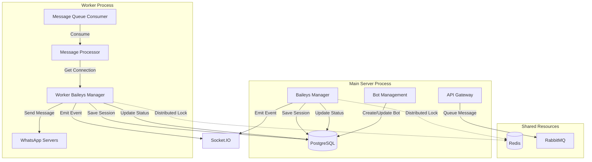

# Design Document

## Overview

This design addresses the architectural challenge where the message worker process cannot access Baileys WhatsApp connections managed by the main server. We'll implement a **worker-managed connection strategy** where the worker initializes and maintains its own Baileys connection pool. This approach is simpler than IPC-based shared connections and aligns better with a distributed, scalable architecture.

The worker will load active bot sessions from the database on startup, establish connections, and process messages from the queue using these connections. Connection state will be synchronized through the database, and we'll use Redis for distributed locking to prevent duplicate connections.

## Architecture

### High-Level Architecture



### Connection Management Strategy

**Decision: Worker-Managed Connections**

We'll implement worker-managed connections because:
- **Simpler architecture**: No IPC complexity
- **Better scalability**: Each worker is independent
- **Fault isolation**: Worker crashes don't affect main server
- **Easier deployment**: No shared memory or socket requirements

**Trade-offs:**
- More memory usage (duplicate connections)
- Potential for connection conflicts (mitigated by distributed locking)
- Session state must be synchronized via database

## Components and Interfaces

### 1. Worker Baileys Manager

**Responsibilities:**
- Initialize Baileys connections for all active bots on worker startup
- Restore sessions from database
- Maintain connection health monitoring
- Handle reconnections with exponential backoff
- Save session state to database
- Prevent duplicate connections using distributed locks

**Interface:**

```typescript
interface WorkerBaileysManager {
  // Initialization
  initialize(): Promise<void>;
  loadActiveBots(): Promise<Bot[]>;
  
  // Connection management
  createConnection(botId: string): Promise<WASocket>;
  getConnection(botId: string): Promise<WASocket | null>;
  closeConnection(botId: string): Promise<void>;
  closeAllConnections(): Promise<void>;
  
  // Session management
  restoreSession(botId: string): Promise<AuthenticationState>;
  saveSession(botId: string, state: AuthenticationState): Promise<void>;
  
  // Health monitoring
  startHealthCheck(): void;
  checkConnectionHealth(botId: string): Promise<boolean>;
  
  // Locking
  acquireConnectionLock(botId: string): Promise<boolean>;
  releaseConnectionLock(botId: string): Promise<void>;
  
  // Graceful shutdown
  shutdown(): Promise<void>;
}

interface ConnectionInfo {
  botId: string;
  socket: WASocket;
  status: 'connecting' | 'connected' | 'disconnected';
  lastHealthCheck: Date;
  processId: number;
  hostname: string;
}
```

**Implementation Details:**

```typescript
class WorkerBaileysManager {
  private connections: Map<string, ConnectionInfo> = new Map();
  private healthCheckInterval: NodeJS.Timeout | null = null;
  private isShuttingDown: boolean = false;
  
  async initialize(): Promise<void> {
    logger.info('Initializing Worker Baileys Manager');
    
    // Load all active bots from database
    const bots = await this.loadActiveBots();
    logger.info(`Found ${bots.length} active bots`);
    
    // Initialize connections for each bot
    for (const bot of bots) {
      try {
        await this.createConnection(bot.id);
      } catch (error) {
        logger.error(`Failed to initialize connection for bot ${bot.id}:`, error);
      }
    }
    
    // Start health monitoring
    this.startHealthCheck();
    
    logger.info('Worker Baileys Manager initialized');
  }
  
  async createConnection(botId: string): Promise<WASocket> {
    // Check if connection already exists
    if (this.connections.has(botId)) {
      logger.warn(`Connection already exists for bot ${botId}`);
      return this.connections.get(botId)!.socket;
    }
    
    // Acquire distributed lock to prevent duplicate connections
    const lockAcquired = await this.acquireConnectionLock(botId);
    if (!lockAcquired) {
      throw new Error(`Could not acquire lock for bot ${botId}`);
    }
    
    try {
      // Restore session from database
      const authState = await this.restoreSession(botId);
      
      // Create Baileys socket
      const socket = makeWASocket({
        auth: authState,
        printQRInTerminal: false,
        logger: pino({ level: 'silent' }),
      });
      
      // Set up event handlers
      this.setupEventHandlers(botId, socket);
      
      // Store connection info
      this.connections.set(botId, {
        botId,
        socket,
        status: 'connecting',
        lastHealthCheck: new Date(),
        processId: process.pid,
        hostname: os.hostname(),
      });
      
      // Update database
      await this.updateConnectionStatus(botId, 'connecting');
      
      logger.info(`Created connection for bot ${botId} in worker process`);
      
      return socket;
    } finally {
      // Release lock after connection is established
      await this.releaseConnectionLock(botId);
    }
  }
  
  private setupEventHandlers(botId: string, socket: WASocket): void {
    // Connection updates
    socket.ev.on('connection.update', async (update) => {
      const { connection, lastDisconnect } = update;
      
      if (connection === 'open') {
        logger.info(`Bot ${botId} connected in worker`);
        await this.updateConnectionStatus(botId, 'connected');
        this.updateConnectionInfo(botId, { status: 'connected' });
      } else if (connection === 'close') {
        logger.warn(`Bot ${botId} disconnected in worker`);
        await this.updateConnectionStatus(botId, 'disconnected');
        this.connections.delete(botId);
        
        // Attempt reconnection
        if (!this.isShuttingDown) {
          this.scheduleReconnection(botId);
        }
      }
    });
    
    // Save credentials on update
    socket.ev.on('creds.update', async () => {
      const authState = await socket.authState.saveCreds();
      await this.saveSession(botId, authState);
    });
  }
  
  private async scheduleReconnection(botId: string, attempt: number = 1): Promise<void> {
    const delay = Math.min(1000 * Math.pow(2, attempt), 30000); // Max 30s
    
    logger.info(`Scheduling reconnection for bot ${botId} in ${delay}ms (attempt ${attempt})`);
    
    setTimeout(async () => {
      try {
        await this.createConnection(botId);
      } catch (error) {
        logger.error(`Reconnection failed for bot ${botId}:`, error);
        if (attempt < 5) {
          this.scheduleReconnection(botId, attempt + 1);
        }
      }
    }, delay);
  }
  
  async shutdown(): Promise<void> {
    logger.info('Shutting down Worker Baileys Manager');
    this.isShuttingDown = true;
    
    // Stop health checks
    if (this.healthCheckInterval) {
      clearInterval(this.healthCheckInterval);
    }
    
    // Save all sessions and close connections
    const closePromises = Array.from(this.connections.keys()).map(async (botId) => {
      try {
        const conn = this.connections.get(botId);
        if (conn) {
          // Save session
          await this.saveSession(botId, await conn.socket.authState.saveCreds());
          
          // Close socket
          await conn.socket.logout();
          
          // Update status
          await this.updateConnectionStatus(botId, 'disconnected');
        }
      } catch (error) {
        logger.error(`Error closing connection for bot ${botId}:`, error);
      }
    });
    
    await Promise.all(closePromises);
    this.connections.clear();
    
    logger.info('Worker Baileys Manager shutdown complete');
  }
}
```

### 2. Enhanced Message Worker

**Responsibilities:**
- Initialize Worker Baileys Manager on startup
- Consume messages from queue
- Process messages using worker-managed connections
- Handle graceful shutdown
- Update message status in database

**Interface:**

```typescript
interface MessageWorker {
  start(): Promise<void>;
  stop(): Promise<void>;
  processMessage(message: QueuedMessage): Promise<void>;
  handleShutdown(): Promise<void>;
}
```

**Implementation:**

```typescript
class MessageWorker {
  private baileysManager: WorkerBaileysManager;
  private queueService: QueueService;
  private isShuttingDown: boolean = false;
  private activeMessages: Set<string> = new Set();
  
  constructor() {
    this.baileysManager = new WorkerBaileysManager();
    this.queueService = new QueueService();
  }
  
  async start(): Promise<void> {
    logger.info('Starting message worker');
    
    // Initialize Baileys connections
    await this.baileysManager.initialize();
    
    // Set up graceful shutdown handlers
    process.on('SIGTERM', () => this.handleShutdown());
    process.on('SIGINT', () => this.handleShutdown());
    
    // Start consuming messages
    await this.queueService.consume('messages', async (message) => {
      if (this.isShuttingDown) {
        // Reject message to requeue it
        return false;
      }
      
      await this.processMessage(message);
      return true;
    });
    
    logger.info('Message worker started');
  }
  
  async processMessage(message: QueuedMessage): Promise<void> {
    const { id, botId, request } = message;
    
    this.activeMessages.add(id);
    
    try {
      logger.info(`Processing message ${id} for bot ${botId}`);
      
      // Get Baileys connection
      const socket = await this.baileysManager.getConnection(botId);
      
      if (!socket) {
        throw new Error(`No active connection for bot ${botId}`);
      }
      
      // Send message via Baileys
      const result = await socket.sendMessage(
        request.to + '@s.whatsapp.net',
        { text: request.content.text }
      );
      
      // Update message status
      await this.updateMessageStatus(id, 'sent', result.key.id);
      
      logger.info(`Message ${id} sent successfully`);
    } catch (error) {
      logger.error(`Failed to process message ${id}:`, error);
      await this.updateMessageStatus(id, 'failed');
      throw error;
    } finally {
      this.activeMessages.delete(id);
    }
  }
  
  async handleShutdown(): Promise<void> {
    if (this.isShuttingDown) return;
    
    logger.info('Graceful shutdown initiated');
    this.isShuttingDown = true;
    
    // Stop accepting new messages
    await this.queueService.stopConsuming();
    
    // Wait for active messages to complete (max 30s)
    const timeout = 30000;
    const startTime = Date.now();
    
    while (this.activeMessages.size > 0 && Date.now() - startTime < timeout) {
      logger.info(`Waiting for ${this.activeMessages.size} messages to complete`);
      await new Promise(resolve => setTimeout(resolve, 1000));
    }
    
    if (this.activeMessages.size > 0) {
      logger.warn(`Shutdown timeout: ${this.activeMessages.size} messages still processing`);
    }
    
    // Shutdown Baileys manager
    await this.baileysManager.shutdown();
    
    // Close queue connection
    await this.queueService.close();
    
    logger.info('Graceful shutdown complete');
    process.exit(0);
  }
}
```

### 3. Distributed Lock Service

**Responsibilities:**
- Provide distributed locking using Redis
- Prevent duplicate connections across processes
- Auto-expire locks to prevent deadlocks

**Interface:**

```typescript
interface LockService {
  acquireLock(key: string, ttl: number): Promise<boolean>;
  releaseLock(key: string): Promise<void>;
  extendLock(key: string, ttl: number): Promise<boolean>;
}
```

**Implementation:**

```typescript
class RedisLockService implements LockService {
  private redis: Redis;
  private locks: Map<string, string> = new Map(); // key -> lockId
  
  async acquireLock(key: string, ttl: number = 30000): Promise<boolean> {
    const lockId = uuidv4();
    const lockKey = `lock:${key}`;
    
    // Try to set lock with NX (only if not exists) and PX (expiry in ms)
    const result = await this.redis.set(lockKey, lockId, 'PX', ttl, 'NX');
    
    if (result === 'OK') {
      this.locks.set(key, lockId);
      logger.debug(`Acquired lock for ${key}`);
      return true;
    }
    
    logger.debug(`Failed to acquire lock for ${key}`);
    return false;
  }
  
  async releaseLock(key: string): Promise<void> {
    const lockId = this.locks.get(key);
    if (!lockId) return;
    
    const lockKey = `lock:${key}`;
    
    // Only delete if we own the lock (compare lockId)
    const script = `
      if redis.call("get", KEYS[1]) == ARGV[1] then
        return redis.call("del", KEYS[1])
      else
        return 0
      end
    `;
    
    await this.redis.eval(script, 1, lockKey, lockId);
    this.locks.delete(key);
    
    logger.debug(`Released lock for ${key}`);
  }
}
```

### 4. Connection Status Synchronization

**Database Schema Addition:**

```sql
-- Add process tracking to bots table
ALTER TABLE bots ADD COLUMN connection_process_id INTEGER;
ALTER TABLE bots ADD COLUMN connection_hostname VARCHAR(255);
ALTER TABLE bots ADD COLUMN connection_updated_at TIMESTAMP;

-- Create index for monitoring queries
CREATE INDEX idx_bots_connection_status ON bots(connection_status, connection_updated_at);
```

**Status Update Service:**

```typescript
interface ConnectionStatusService {
  updateStatus(botId: string, status: string, processInfo: ProcessInfo): Promise<void>;
  getStatus(botId: string): Promise<ConnectionStatus>;
  listActiveConnections(): Promise<ConnectionStatus[]>;
  cleanupStaleConnections(): Promise<void>;
}

interface ProcessInfo {
  processId: number;
  hostname: string;
}

interface ConnectionStatus {
  botId: string;
  status: string;
  processId: number | null;
  hostname: string | null;
  updatedAt: Date;
}
```

### 5. Socket.IO Event Emission

Both main server and worker should emit socket events when connection status changes:

```typescript
// In both MainBaileysService and WorkerBaileysManager
async updateConnectionStatus(botId: string, status: string): Promise<void> {
  // Update database
  await db.query(
    `UPDATE bots 
     SET connection_status = $1, 
         connection_process_id = $2,
         connection_hostname = $3,
         connection_updated_at = CURRENT_TIMESTAMP
     WHERE id = $4`,
    [status, process.pid, os.hostname(), botId]
  );
  
  // Emit socket event (if socket service is available)
  if (socketService) {
    const bot = await this.getBotWithUser(botId);
    socketService.emitToBotUser(bot.userId, 'bot:status', {
      botId,
      status,
      processId: process.pid,
      hostname: os.hostname(),
    });
  }
}
```

## Data Models

### Updated Bot Model

```typescript
interface Bot {
  id: string;
  userId: string;
  name: string;
  phoneNumber?: string;
  webhookUrl?: string;
  autoResponseEnabled: boolean;
  connectionStatus: 'connecting' | 'qr_required' | 'connected' | 'disconnected';
  qrCode?: string;
  
  // New fields for process tracking
  connectionProcessId?: number;
  connectionHostname?: string;
  connectionUpdatedAt?: Date;
  
  createdAt: Date;
  updatedAt: Date;
  isActive: boolean;
}
```

## Error Handling

### Connection Errors

```typescript
class ConnectionError extends Error {
  constructor(
    public botId: string,
    public code: string,
    message: string
  ) {
    super(message);
    this.name = 'ConnectionError';
  }
}

// Error codes
enum ConnectionErrorCode {
  NO_ACTIVE_CONNECTION = 'NO_ACTIVE_CONNECTION',
  LOCK_ACQUISITION_FAILED = 'LOCK_ACQUISITION_FAILED',
  SESSION_RESTORE_FAILED = 'SESSION_RESTORE_FAILED',
  CONNECTION_TIMEOUT = 'CONNECTION_TIMEOUT',
  DUPLICATE_CONNECTION = 'DUPLICATE_CONNECTION',
}
```

### Retry Strategy

**Connection Initialization:**
- Max 5 attempts
- Exponential backoff: 1s, 2s, 4s, 8s, 16s, 30s (capped)
- Log each attempt

**Message Processing:**
- Existing retry logic (3 attempts with exponential backoff)
- If connection is missing, attempt to create it before retrying message

## Testing Strategy

### Unit Tests

- WorkerBaileysManager connection lifecycle
- Lock acquisition and release logic
- Session save/restore functionality
- Graceful shutdown sequence

### Integration Tests

- Worker startup with multiple bots
- Message processing through worker connections
- Connection status synchronization between processes
- Distributed lock preventing duplicate connections
- Graceful shutdown with in-flight messages

### Load Tests

- Worker handling 100 messages/minute
- Multiple workers processing from same queue
- Connection health under sustained load

## Deployment Considerations

### Environment Variables

```bash
# Worker configuration
WORKER_ENABLED=true
WORKER_CONCURRENCY=5
WORKER_HEALTH_CHECK_INTERVAL=30000

# Redis for distributed locking
REDIS_URL=redis://localhost:6379

# Graceful shutdown timeout
SHUTDOWN_TIMEOUT=60000
```

### Process Management

```json
// ecosystem.config.js for PM2
{
  "apps": [
    {
      "name": "api-server",
      "script": "dist/index.js",
      "instances": 2,
      "exec_mode": "cluster"
    },
    {
      "name": "message-worker",
      "script": "dist/workers/message.worker.js",
      "instances": 1,
      "exec_mode": "fork",
      "kill_timeout": 60000
    }
  ]
}
```

### Monitoring

**Metrics to track:**
- Active connections per process
- Connection creation/failure rate
- Lock acquisition success rate
- Message processing latency
- Graceful shutdown duration

**Alerts:**
- Connection failures > 10% in 5 minutes
- Lock acquisition failures
- Worker process crashes
- Shutdown timeout exceeded

## Migration Plan

1. **Phase 1**: Implement WorkerBaileysManager
2. **Phase 2**: Add distributed locking
3. **Phase 3**: Update message worker to use new manager
4. **Phase 4**: Add process tracking to database
5. **Phase 5**: Implement graceful shutdown
6. **Phase 6**: Deploy and monitor

## Alternative Approaches Considered

### Shared Connection Pool via IPC

**Pros:**
- Single connection per bot (less memory)
- Centralized connection management

**Cons:**
- Complex IPC implementation
- Tight coupling between processes
- Harder to scale horizontally
- Single point of failure

**Decision**: Rejected due to complexity and scalability concerns

### HTTP API for Connection Access

**Pros:**
- Simple protocol
- Language agnostic

**Cons:**
- High latency for each message
- Additional network overhead
- Requires authentication layer

**Decision**: Rejected due to performance concerns
