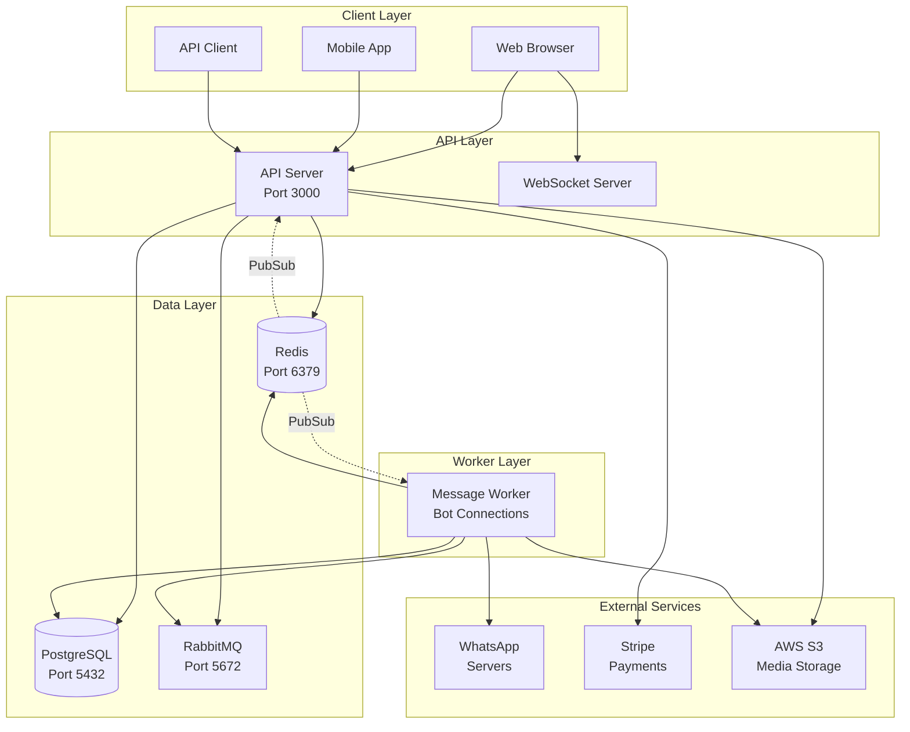
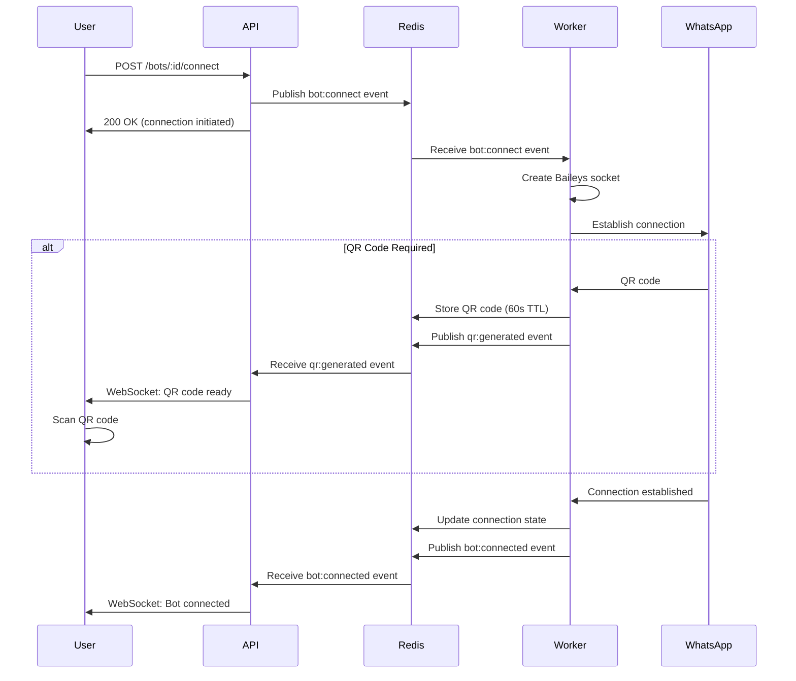
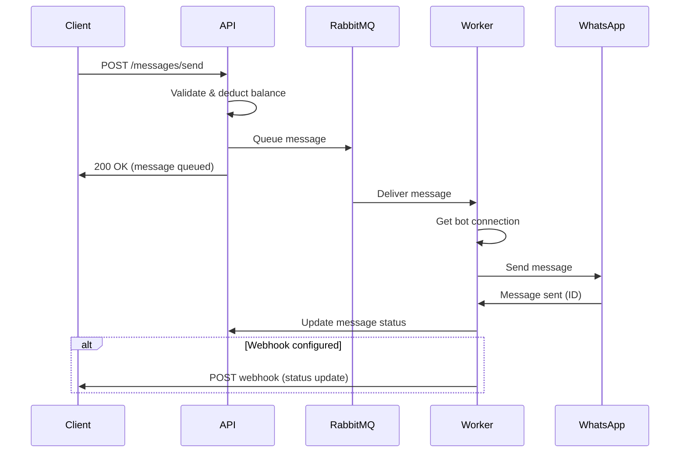

# System Architecture

## Overview

The WhatsApp API Monetization Platform uses a split architecture design that separates the API server from the bot connection worker. This design ensures stable bot connections during development and provides better scalability in production.

## High-Level Architecture



## Component Details

### 1. API Server

**Responsibilities:**
- Handle HTTP requests (REST API)
- Manage WebSocket connections for real-time updates
- User authentication and authorization
- Bot management (CRUD operations)
- Message queueing
- Billing and payments
- Media upload/download

**Technology:**
- Node.js + Express
- TypeScript
- Socket.IO for WebSockets
- JWT for authentication

**Restart Behavior:**
- Restarts automatically on code changes (development)
- Does NOT manage bot connections
- Stateless (can scale horizontally)

### 2. Message Worker

**Responsibilities:**
- Manage WhatsApp bot connections via Baileys
- Process message queue from RabbitMQ
- Send messages to WhatsApp
- Handle incoming messages
- Maintain connection health
- Auto-reconnect on failures

**Technology:**
- Node.js
- TypeScript
- Baileys (WhatsApp Web Multi-Device API)
- RabbitMQ consumer

**Restart Behavior:**
- Stays running during API code changes (development)
- Graceful shutdown (saves sessions, closes connections)
- Auto-reconnects bots on startup

### 3. PostgreSQL Database

**Stores:**
- Users and authentication data
- Bots and their configurations
- Messages and their status
- Transactions and billing history
- Media file metadata
- API keys

**Schema:**
```
users
├── id (uuid)
├── email
├── password_hash
├── balance
└── created_at

bots
├── id (uuid)
├── user_id (fk)
├── name
├── phone_number
├── connection_status
├── webhook_url
└── created_at

messages
├── id (uuid)
├── bot_id (fk)
├── user_id (fk)
├── to
├── type
├── content (jsonb)
├── status
├── cost
└── created_at
```

### 4. Redis

**Uses:**
- **Caching**: User sessions, bot status
- **Rate Limiting**: API request throttling
- **PubSub**: Inter-process communication
  - `bot:connect` - Request bot connection
  - `bot:disconnect` - Request bot disconnection
  - `qr:generated` - QR code ready
  - `bot:connected` - Bot successfully connected
  - `bot:disconnected` - Bot disconnected
- **Connection State**: Bot health metrics, connection status
- **QR Codes**: Temporary storage (60s TTL)
- **Worker Heartbeat**: Worker health monitoring

**Key Patterns:**
```
qr:{botId}                          - QR code (60s TTL)
worker:{workerId}:heartbeat         - Worker heartbeat (30s TTL)
worker:{workerId}:connections       - Bot list (30s TTL)
bot:connection:{botId}:state        - Connection state (5min TTL)
bot:connection:{botId}:health       - Health metrics (5min TTL)
```

### 5. RabbitMQ

**Queues:**
- `messages.send` - Outgoing messages
- `messages.send.dlq` - Dead letter queue for failed messages

**Message Flow:**
```
API Server → RabbitMQ → Message Worker → WhatsApp
```

**Benefits:**
- Reliable message delivery
- Retry logic for failures
- Load balancing across workers
- Message persistence

## Communication Flow

### Bot Connection Flow



### Message Sending Flow



## Development vs Production

### Development Mode

```
┌─────────────────────────────────────────┐
│  Developer Machine                      │
│                                         │
│  ┌──────────────┐  ┌─────────────────┐ │
│  │ API Server   │  │ Message Worker  │ │
│  │ (nodemon)    │  │ (ts-node-dev)   │ │
│  │ Restarts ✓   │  │ Persistent ✓    │ │
│  └──────────────┘  └─────────────────┘ │
│         │                    │          │
│         └────────┬───────────┘          │
│                  ↓                      │
│         ┌────────────────┐              │
│         │ Local Services │              │
│         │ - PostgreSQL   │              │
│         │ - Redis        │              │
│         │ - RabbitMQ     │              │
│         └────────────────┘              │
└─────────────────────────────────────────┘
```

**Command:** `npm run dev`

**Benefits:**
- API restarts on code changes
- Worker stays running
- Bots stay connected
- Fast iteration

### Production Mode (PM2)

```
┌─────────────────────────────────────────┐
│  Production Server                      │
│                                         │
│  ┌──────────────┐  ┌─────────────────┐ │
│  │ API Server   │  │ Message Worker  │ │
│  │ (2 instances)│  │ (1 instance)    │ │
│  │ Cluster mode │  │ Fork mode       │ │
│  └──────────────┘  └─────────────────┘ │
│         │                    │          │
│         └────────┬───────────┘          │
│                  ↓                      │
│         ┌────────────────┐              │
│         │ Services       │              │
│         │ - PostgreSQL   │              │
│         │ - Redis        │              │
│         │ - RabbitMQ     │              │
│         └────────────────┘              │
└─────────────────────────────────────────┘
```

**Command:** `npm run pm2:start`

**Benefits:**
- Multiple API instances (load balancing)
- Single worker instance (avoid connection conflicts)
- Auto-restart on crashes
- Log management
- Monitoring

### Production Mode (Docker)

```
┌─────────────────────────────────────────┐
│  Docker Host                            │
│                                         │
│  ┌──────────────┐  ┌─────────────────┐ │
│  │ api-server   │  │ message-worker  │ │
│  │ container    │  │ container       │ │
│  └──────────────┘  └─────────────────┘ │
│         │                    │          │
│         └────────┬───────────┘          │
│                  ↓                      │
│  ┌──────────┐ ┌───────┐ ┌──────────┐  │
│  │postgres  │ │ redis │ │ rabbitmq │  │
│  │container │ │contain│ │ container│  │
│  └──────────┘ └───────┘ └──────────┘  │
│                                         │
│  ┌─────────────────────────────────┐   │
│  │ Shared Volume: sessions/        │   │
│  └─────────────────────────────────┘   │
└─────────────────────────────────────────┘
```

**Command:** `docker-compose up`

**Benefits:**
- Isolated environments
- Easy deployment
- Shared session volume
- Service orchestration
- Scalability

## Scalability Considerations

### Horizontal Scaling

**API Server:**
- ✅ Can scale horizontally (stateless)
- Use load balancer (Nginx, HAProxy)
- Session data in Redis (shared state)

**Message Worker:**
- ⚠️ Single instance recommended (avoid connection conflicts)
- Use distributed locks for multi-worker setup
- Each worker manages subset of bots

### Vertical Scaling

**Memory:**
- Each bot connection: ~10-20MB
- 100 bots: ~1-2GB RAM
- Monitor with `npm run pm2:monit`

**CPU:**
- Message processing is I/O bound
- CPU usage spikes during high message volume
- Consider message batching

## Security

### Authentication
- JWT tokens for API access
- API keys for bot-specific operations
- Refresh tokens for long-lived sessions

### Data Protection
- Passwords hashed with bcrypt
- API keys encrypted in database
- HTTPS in production
- Rate limiting on all endpoints

### WhatsApp Sessions
- Stored in encrypted format
- Isolated per bot
- Backed up regularly
- Cleaned up on bot deletion

## Monitoring

### Health Checks

**API Server:**
```
GET /health
Response: { status: "ok", uptime: 12345 }
```

**Worker:**
```
GET /health/worker
Response: {
  status: "ok",
  connections: 5,
  uptime: 12345,
  memory: { used: 512, total: 1024 }
}
```

### Metrics

- Connection count
- Message throughput
- Error rates
- Response times
- Queue depth
- Worker health

### Logging

- Structured JSON logs
- Log levels: error, warn, info, debug
- Separate files for API and worker
- Log rotation (daily)

## Disaster Recovery

### Session Backup
- Sessions stored in `sessions/` directory
- Backed up to S3 daily
- Restore on worker restart

### Database Backup
- PostgreSQL daily backups
- Point-in-time recovery
- Replication for high availability

### Failover
- API: Load balancer redirects to healthy instances
- Worker: Auto-restart on crash, reconnects bots
- Database: Automatic failover to replica

## Future Enhancements

1. **Multi-Worker Support**
   - Distributed locking for bot assignment
   - Worker coordination via Redis
   - Load balancing across workers

2. **Message Batching**
   - Batch multiple messages to same recipient
   - Reduce API calls to WhatsApp
   - Improve throughput

3. **Advanced Monitoring**
   - Prometheus metrics
   - Grafana dashboards
   - Alert manager integration

4. **Caching Layer**
   - Cache frequently accessed data
   - Reduce database load
   - Improve response times

5. **CDN Integration**
   - Serve media files via CDN
   - Reduce bandwidth costs
   - Improve delivery speed
